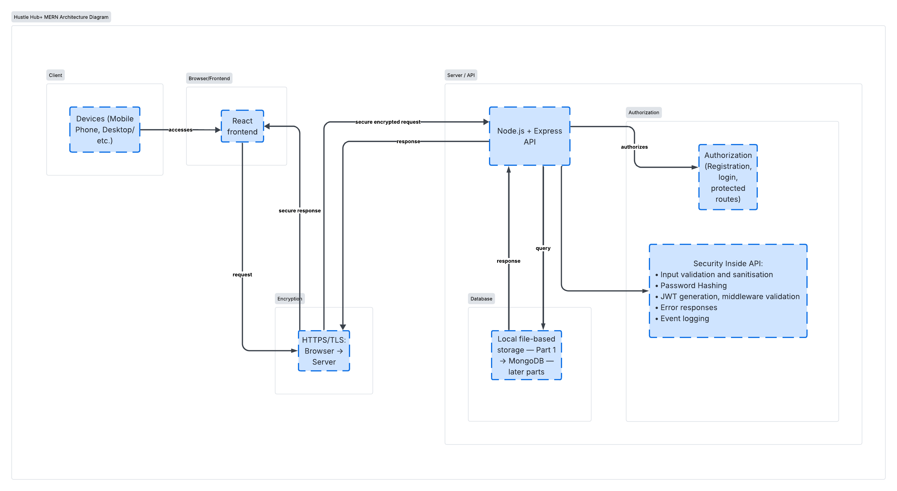

# HustleHub+

Secure freelance marketplace (INSY7314 POE Part 1).

**Team:** Sihle, Lesedi, Thami, Blessing

This repository currently contains the Part 1 backend API (Node.js and Express). The overall system follows a MERN architecture (MongoDB, Express, React, Node.js). MongoDB and the React client will be added in later parts; Part 1 uses file-based user storage.

---

## How to run the API (Part 1)

Requirements: Node.js 18 or newer.

```bash
cd backend
copy .env.example .env
```

On macOS/Linux use `cp .env.example .env`. Open `.env` and replace `JWT_SECRET` with a random string of at least 32 characters.

```bash
npm install
npm run generate-certs
npm start
```

The API listens on `https://127.0.0.1:3443`.

- Health check: `GET https://127.0.0.1:3443/health`
- Register: `POST https://127.0.0.1:3443/api/auth/register`
- Login: `POST https://127.0.0.1:3443/api/auth/login`
- Current user (JWT required): `GET https://127.0.0.1:3443/api/me`

The TLS certificate is self-signed. In Postman, turn off SSL certificate verification for local requests.

---

## TODO — Blessing (Architecture Lead)

Replace the headings below with the written explanations required for Part 1. Include all discussion in this README (no separate documents). Use the sources in [docs/REFERENCES.md](docs/REFERENCES.md) (all published 2016 or later).

### System overview

<!-- Explain what HustleHub+ is and what problem it solves. -->

### Intended users

<!-- Describe Clients, Freelancers, and Admin users and what each can do. -->

### Backend structure

<!-- Explain the Express layout (routes, middleware, config, storage) and how requests flow. -->

### Architecture diagram (MERN)

<!-- Put the PNG in docs/images/architecture-diagram.png then uncomment the next line. A Mermaid starter is in docs/architecture.md. -->

<!--  -->

### Security decisions

#### Password hashing

<!-- Why passwords must never be stored in plain text; which algorithm is used and why. -->

#### Token-based authentication (JWT)

<!-- How login issues a token, how protected routes validate it on every request, and why this matters. -->

#### Input validation

<!-- How the API rejects invalid or malicious input before processing. -->

#### HTTPS

<!-- Why the API is served over TLS and how the local certificate is configured. -->

### References

<!-- Copy the Harvard reference list from docs/REFERENCES.md into this section. -->

---

## Remaining teammate work (Part 1)

| Member | Role | Still to complete |
| --- | --- | --- |
| Blessing | Architecture | Fill the README sections above, paste [docs/REFERENCES.md](docs/REFERENCES.md) into References, and add the diagram PNG (starter in [docs/architecture.md](docs/architecture.md)). |
| Thami | Testing | Import [postman/HustleHub.postman_collection.json](postman/HustleHub.postman_collection.json), run the 8 requests, take screenshots, and record the demo video. |
