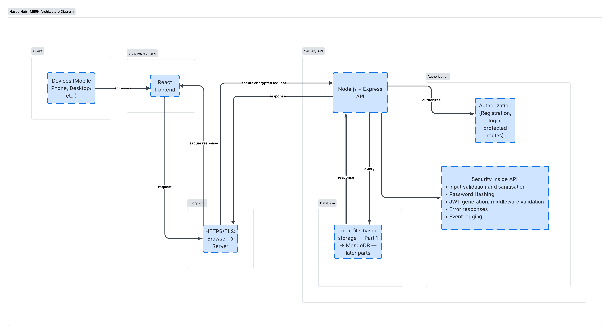
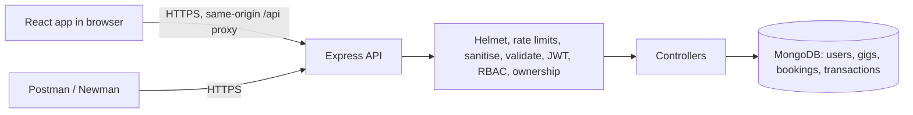

# HustleHub+

## A Secure Freelance Marketplace Platform

HustleHub+ is a **freelance marketplace platform** where **freelancers advertise their services** and **clients browse and book those services**. Every booking produces a **transaction record**, and freelancers can track the **income** earned from their bookings. Administrators manage and oversee the platform.

HustleHub+ handles sensitive information such as **user credentials, transaction records and income data**, so security is treated as a core requirement throughout the system rather than an afterthought.

**Part 2 (Secure Stack)** extends the Part 1 secure backend into a full-stack MERN application with a MongoDB database, a React frontend, gig management, bookings, transactions, income tracking, role-based access control and expanded security testing.

---

## Table of Contents

- [System Overview](#system-overview)
- [Intended Users](#intended-users)
- [Features](#features)
- [Technology Stack](#technology-stack)
- [System Architecture](#system-architecture)
- [Data Flow](#data-flow)
- [API Endpoints](#api-endpoints)
- [Security](#security)
- [Project Structure](#project-structure)
- [Getting Started](#getting-started)
- [Environment Variables](#environment-variables)
- [Testing](#testing)
- [Evidence and Demonstration Videos](#evidence-and-demonstration-videos)
- [Authors](#authors)
- [Reference List](#reference-list)

---

# System Overview

HustleHub+ is a **full-stack web application** built on the MERN stack (MongoDB, Express.js, React and Node.js).

The system provides:

- Secure registration and login with hashed passwords and JSON Web Tokens (JWT).
- Role-based access control for clients, freelancers and administrators.
- Gig management: freelancers create, view, update and delete **their own** gigs.
- A marketplace where clients browse active gigs and book them.
- Simulated payment: every booking is confirmed immediately and creates a **transaction record** linked to the client, freelancer, gig and booking.
- Income tracking for freelancers, in total and per month.
- Security controls at every layer: HTTPS, validation, sanitisation, rate limiting, security headers with a Content Security Policy, safe error handling and security event logging.

---

# Intended Users

| Role | Description |
|------|-------------|
| **Freelancer** | Registers on the platform, advertises services as gigs, views bookings made on their gigs and tracks the income earned from them. |
| **Client** | Browses available gigs, books services from freelancers and views their own bookings and transactions. |
| **Administrator** | Manages and oversees the platform. Admin accounts cannot be self-registered; they are created by the platform operators. |

**Role-Based Access Control (RBAC)** ensures that users can only reach the functionality that belongs to their role, and ownership checks ensure that users can only change or view **their own** records.

---

# Features

### All users
- Register as a client or freelancer, and log in.
- The JWT returned at login identifies the user on every later request.
- Errors are shown as short, safe messages.

### Freelancers
- Create gigs with a title, description, category, price (ZAR) and delivery time.
- View, update (including hiding a gig by making it inactive) and delete their own gigs.
- View every booking made on their gigs.
- View their transactions and an **income summary** (total income, number of transactions and a monthly breakdown).

### Clients
- Browse and search active gigs from all freelancers.
- Book a gig. The booking is confirmed with a reference such as `HH-1A2B3C4D`, the payment is simulated, and a transaction is recorded.
- View their own bookings and transactions.

### Frontend (React)
- Registration and login screens connected to the API, with client-side validation and safe error messages.
- Browse gigs, freelancer gig management and client booking screens.
- The JWT is kept in `sessionStorage`, so it is cleared when the browser tab is closed.
- Served with a Content Security Policy and security headers (see [Frontend CSP](#content-security-policy-and-security-headers)).

> Status: login and registration call the live API. The gig browsing, gig management and booking screens are being connected to the gig, booking and transaction endpoints listed below.

---

# Technology Stack

| Technology | Purpose |
|------------|---------|
| **MongoDB** + Mongoose | Persistent storage for users, gigs, bookings and transactions |
| **Express.js** | Backend web framework and API routing |
| **React** (Vite) | Frontend user interface |
| **Node.js** | Backend JavaScript runtime with a built-in HTTPS server |
| bcryptjs | Password hashing (cost factor 12) |
| jsonwebtoken | JWT signing and verification |
| express-validator | Input validation and escaping |
| helmet | HTTP security headers and Content Security Policy |
| express-rate-limit | Rate limiting on sensitive endpoints |
| Jest, Supertest, mongodb-memory-server | Backend unit and integration tests |
| Postman + Newman | API endpoint testing |

---

# System Architecture

HustleHub+ follows a **3-tier architecture**: the React presentation tier, the Express API tier and the MongoDB data tier. Everything the user controls (the browser, Postman) is outside the system boundary and treated as untrusted. Every request passes through HTTPS and the API's security middleware before it reaches business logic or the database.



The up-to-date Part 2 diagram, including the security middleware chain and the booking sequence, is in [docs/architecture.md](docs/architecture.md).


```mermaid
flowchart LR
  Browser[React app in browser] -->|"HTTPS, same-origin /api proxy"| Api[Express API]
  Postman[Postman / Newman] -->|HTTPS| Api
  Api --> Chain["Helmet, rate limits, sanitise, validate, JWT, RBAC, ownership"]
  Chain --> Controllers[Controllers]
  Controllers --> Mongo[(MongoDB: users, gigs, bookings, transactions)]
```

---

# Data Flow

### 1. User request
The user opens the React frontend on a desktop, laptop, tablet or phone. The frontend sends JSON requests to `/api/...` on its own origin, and the Vite server proxies them to the API.

### 2. Secure communication (Kath, 2021)
Requests reach the API over **HTTPS/TLS**, which encrypts credentials, tokens and financial data in transit.

### 3. API processing
Each request passes through the security middleware in order:
1. Helmet security headers.
2. Rate limiting.
3. A JSON-only body check and a 16 KB size limit.
4. Sanitisation against NoSQL operators and prototype pollution.
5. Validation and escaping.
6. JWT verification.
7. Role checks.

Controllers then apply ownership checks and business rules.

### 4. Database access (MongoDB, 2026)
Controllers read and write MongoDB through Mongoose models. Queries are always scoped to the user id taken from the verified JWT.

### 5. Response
The API returns a JSON response. Errors are reduced to short, safe messages. The frontend updates the interface.

---

# API Endpoints

Base URL: `https://127.0.0.1:3443`. All `/api` routes except register and login require `Authorization: Bearer <token>`.

### Authentication
| Method | Path | Who | Notes |
|---|---|---|---|
| GET | `/health` | public | Health check |
| POST | `/api/auth/register` | public | `email`, `password`, `fullName`, `role` (`client` or `freelancer`). Rate limited |
| POST | `/api/auth/login` | public | Returns a JWT. Rate limited |
| GET | `/api/me` | any user | Current user profile |

### Gigs
| Method | Path | Who | Notes |
|---|---|---|---|
| GET | `/api/gigs` | any user | Active gigs. Optional `?category=&search=&page=&limit=` |
| GET | `/api/gigs/mine` | freelancer | Own gigs, including inactive ones |
| GET | `/api/gigs/:id` | any user | Inactive gigs are only visible to their owner |
| POST | `/api/gigs` | freelancer | The owner is taken from the JWT |
| PUT | `/api/gigs/:id` | owning freelancer | Partial update. 403 if not the owner |
| DELETE | `/api/gigs/:id` | owning freelancer | 403 if not the owner |

### Bookings and transactions
| Method | Path | Who | Notes |
|---|---|---|---|
| POST | `/api/bookings` | client | `{ gigId, notes? }`. Price and freelancer come from the stored gig. Creates a booking **and** a transaction. Rate limited per client |
| GET | `/api/bookings/mine` | client, freelancer | A client sees bookings they made; a freelancer sees bookings on their gigs |
| GET | `/api/bookings/:id` | booking parties only | 404 for anyone who is not the client or freelancer on the booking |
| GET | `/api/transactions/mine` | client, freelancer | Only the caller's own transactions |
| GET | `/api/transactions/income` | freelancer | `totalIncome`, `transactionCount` and a `monthly` breakdown in ZAR |

---

# Security

Security is a primary design consideration because HustleHub+ processes user credentials, authentication tokens, transaction records, income data and personal information. The controls below are implemented in Part 2. Each section names the files where the control lives.

## Password Hashing and Verification (Charity, 2024; OWASP, 2025d)

Passwords are hashed with **bcrypt** (cost factor 12) before they are stored. Plain-text passwords are never stored or logged, and the hash is never returned by the API. Login compares the submitted password with the stored hash using `bcrypt.compare`. Passwords are limited to 8 to 72 characters because bcrypt ignores anything beyond 72 bytes.

`backend/src/utils/password.js`

## JWT Authentication (Sheffer, Hardt and Jones, 2020; OWASP, 2025a)

After a successful registration or login, the API issues a **short-lived JWT** (1 hour by default).

- Tokens are signed with **HS256** using `JWT_SECRET`. The secret comes from the environment, must be at least 32 characters, and the server refuses to start with the example placeholder.
- Verification is restricted to HS256, so **`alg: none`** and algorithm-confusion tokens are rejected.
- Tokens carry and must match an **issuer** (`hustlehub-api`) and **audience** (`hustlehub-web`), so tokens issued for anything else are refused.
- The **role** claim must be one of the known roles.
- Every protected route verifies the token on **every request**. A missing, expired, tampered or forged token gets a generic `401 Invalid or expired token`.

`backend/src/utils/jwt.js`, `backend/src/middleware/authenticate.js`

## Role-Based Access Control and Ownership (OWASP, 2025h)

- `requireRole(...)` runs after authentication and reads the role from the **verified token**, never from the request body. Only freelancers can manage gigs. Only clients can book. Only freelancers can read income.
- Users cannot register as `admin`, which blocks privilege escalation at sign-up.
- **Ownership** is enforced in the controllers:
  - The owner of a new gig is always the caller.
  - Updating or deleting someone else's gig returns 403.
  - Bookings and transactions are always filtered by the caller's id.
  - Viewing a booking you are not part of returns **404**, so other users cannot even confirm that the booking exists.
- **Server-side pricing:** the booking price and freelancer are copied from the stored gig. A client cannot send their own price, and unknown fields such as `price` are rejected.

`backend/src/middleware/authorize.js`, `backend/src/controllers/gigController.js`, `backend/src/controllers/bookingController.js`, `backend/src/controllers/transactionController.js`

## Input Validation (OWASP, 2025c; Expressjs, 2025)

Every request body, query string and URL parameter is validated with **express-validator** before any business logic runs:

- Types, lengths and ranges are checked (for example, price between 1 and 1,000,000, and valid MongoDB ids).
- Emails are normalised.
- **Unknown fields are rejected** (`400 Unexpected fields in request`). This blocks mass-assignment attacks such as sending `role`, `freelancer` or `price` in a body that should not contain them.
- Invalid requests get `400 Invalid request data` with a list of the fields that failed, without echoing the raw input back.

`backend/src/validators/*.js`, `backend/src/middleware/validate.js`

## Sanitisation against Injection and Scripting Attacks (OWASP, 2025c; OWASP, 2025e; OWASP, 2025f)

- **NoSQL injection:** a global middleware rejects any body, query or parameter key that starts with `$` or contains `.`. A payload such as `{"email": {"$gt": ""}}` therefore cannot turn a lookup into "match anything". Search and category filters are also regex-escaped.
- **Prototype pollution:** keys named `__proto__`, `constructor` or `prototype` are rejected.
- **XSS:** free text (names, gig titles, descriptions, categories, booking notes) is trimmed and **HTML-escaped** before storage, so `<script>` is stored as `&lt;script&gt;`. React also escapes everything it renders, and the app never uses `dangerouslySetInnerHTML`.
- **Content type:** write requests must be `application/json` (otherwise **415**), and bodies are capped at **16 KB** (otherwise **413**).

`backend/src/middleware/sanitize.js`

## Rate Limiting (express-rate-limit, 2025; OWASP, 2025a)

| Limiter | Applies to | Default limit | Keyed by |
|---|---|---|---|
| `authLimiter` | `POST /api/auth/register`, `POST /api/auth/login` | 20 per 15 minutes | IP address |
| `bookingLimiter` | `POST /api/bookings` | 10 per hour | Client account |
| `writeLimiter` | Gig create, update, delete | 60 per 15 minutes | Freelancer account |
| `apiLimiter` | Every `/api` route | 300 per 15 minutes | IP address |

When a limit is exceeded, the API returns **429** with a short JSON message and logs a `rate_limited` event. Standard `RateLimit` headers tell clients when they can retry. The login limiter slows down brute-force and credential-stuffing attacks. The booking limiter stops one account from flooding freelancers with bookings or generating large numbers of transaction records. All limits can be tuned in `.env`.

`backend/src/middleware/rateLimiters.js`

## Content Security Policy and Security Headers (Helmetjs, 2025; OWASP, 2025g; MDN, 2025)

**API (Helmet).** The API only returns JSON, so its policy denies everything:

```text
Content-Security-Policy: default-src 'none'; frame-ancestors 'none'; base-uri 'none'; form-action 'none'
X-Frame-Options: DENY
X-Content-Type-Options: nosniff
Referrer-Policy: no-referrer
Cross-Origin-Resource-Policy: same-origin
Cache-Control: no-store            (on every /api response, so tokens and income data are never cached)
Strict-Transport-Security          (production only, so browsers don't pin the local self-signed certificate)
```

`X-Powered-By` is removed so the framework is not advertised. CORS is deliberately **not** enabled: the React app calls the API on its own origin through the Vite proxy, so browsers block other websites from calling the API with a user's session.

**Frontend (Vite).** `frontend/vite.config.js` sends a CSP that only allows scripts, styles, images, fonts and API calls from the app's own origin. It also blocks plugins (`object-src 'none'`) and framing (`frame-ancestors 'none'`), and sets `X-Content-Type-Options`, `X-Frame-Options`, `Referrer-Policy` and `Permissions-Policy`. The strict policy is served by `npm run preview` (the production build). The dev server (`npm run dev`) additionally allows Vite's inline hot-reload script, inline styles and its websocket, because development tooling needs them.

`backend/src/app.js`, `frontend/vite.config.js`

## Secure Error Handling (Expressjs, 2025; OWASP, 2024)

A central error handler logs full details on the server and returns only a short, fixed message to the client. Stack traces, file paths, database errors and configuration values are never sent to the client.

| Situation | Response |
|---|---|
| Expected application errors | Their safe message, for example `403 You can only modify your own gigs` |
| Malformed JSON | `400 Request body is not valid JSON` |
| Body over 16 KB | `413 Request body is too large` |
| Invalid MongoDB id or schema error | `400 Invalid request data` |
| Anything unexpected | `500 An unexpected error occurred` |

`backend/src/middleware/errorHandler.js`

## HTTPS/TLS (Expressjs, 2025; Node.js, 2025)

The API runs on Node's built-in HTTPS server (`backend/src/server.js`) with a locally generated certificate (`npm run generate-certs`). It only listens on `127.0.0.1`. HTTPS encrypts credentials, tokens and financial data in transit. The certificate is self-signed for local development, so browsers and Postman show a warning. A production deployment would use a certificate from a trusted Certificate Authority and set `NODE_ENV=production` to turn on HSTS.

## Security Event Logging (OWASP, 2025b)

Key events are written as structured JSON lines:

- Successful and failed logins, and registrations.
- Missing or invalid tokens.
- RBAC denials and gig or booking ownership denials.
- Rejected unsafe input and rate-limit hits.
- Gig changes and bookings, including the linked transaction id.

Passwords, password hashes, tokens and secrets are filtered out before anything is written. Set `LOG_FILE` to write events to a file instead of the console.

`backend/src/utils/logger.js`

## Security Review Summary

| Threat | Mitigation |
|---|---|
| Credential theft from the database | bcrypt hashes, no plain-text storage |
| Brute force and credential stuffing | Auth rate limiter, generic login error |
| Forged or tampered tokens | HS256-only verification, issuer, audience, role and expiry checks |
| Privilege escalation | No admin self-registration, role taken from the verified token, unknown fields rejected |
| Broken object-level access (IDOR) | Ownership checks, queries scoped to the caller, 404 on other users' bookings |
| Price tampering | Booking price read from the database, `price` field refused |
| NoSQL injection | `$` and `.` keys rejected, typed validators, regex escaping |
| XSS | Input escaping, React output escaping, strict CSP |
| Clickjacking | `frame-ancestors 'none'`, `X-Frame-Options: DENY` |
| Information leakage | Safe error handler, `X-Powered-By` removed, no-store caching |
| Booking or transaction flooding | Per-account booking rate limiter |
| Eavesdropping | HTTPS/TLS |

---

# Project Structure

```text
HustleHub/
├── backend/
│   ├── scripts/
│   │   ├── generate-certs.js        # local self-signed TLS certificate
│   │   └── run-api-tests.js         # Newman runner (HTTPS API + in-memory MongoDB)
│   ├── src/
│   │   ├── app.js                   # Express app: headers, limits, sanitising, routes
│   │   ├── server.js                # HTTPS entry point
│   │   ├── config/                  # env loading/validation, MongoDB connection
│   │   ├── controllers/             # auth, user, gig, booking, transaction logic
│   │   ├── middleware/              # authenticate, authorize, sanitize, rateLimiters, validate, errors
│   │   ├── models/                  # User, Gig, Booking, Transaction (Mongoose)
│   │   ├── routes/                  # auth, me, gigs, bookings, transactions, health
│   │   ├── utils/                   # jwt, password, logger, AppError
│   │   └── validators/              # auth, gig, booking input rules
│   ├── tests/                       # Jest + Supertest: auth, gigs, bookings, security
│   └── .env.example
├── frontend/
│   ├── src/                         # React app (App.jsx, GigBrowser.jsx)
│   └── vite.config.js               # API proxy, CSP and security headers
├── postman/
│   └── HustleHub.postman_collection.json
└── docs/
    ├── architecture.md              # Part 2 architecture and booking flow diagrams
    ├── evidence/                    # Newman output, JUnit report, server event log
    └── images/
```

---

# Getting Started

## Prerequisites

- Node.js 18 or later (tested on Node 22) and npm
- MongoDB running locally (or a MongoDB Atlas connection string)
- Git

## 1. Run the backend API

```bash
cd backend
copy .env.example .env        # macOS/Linux: cp .env.example .env
```

Open `.env` and replace `JWT_SECRET` with a random string of at least 32 characters. For example, you can generate one with:

```bash
node -e "console.log(require('crypto').randomBytes(48).toString('hex'))"
```

Then install, create the local certificate and start the API (make sure MongoDB is running first):

```bash
npm install
npm run generate-certs
npm start
```

The API listens on **https://127.0.0.1:3443**. Check it with `GET https://127.0.0.1:3443/health`.

## 2. Run the React frontend

In a second terminal:

```bash
cd frontend
npm install
npm run dev
```

Open the URL Vite prints (usually http://localhost:5173). The dev server forwards `/api` requests to the HTTPS API, so the API must be running. To check the strict production CSP, run `npm run build` and then `npm run preview`.

## Localhost certificate warning

The certificate is self-signed, so browsers and Postman show a warning. This is expected locally. In Postman, turn off **SSL certificate verification** under Settings.

---

# Environment Variables

Secrets and configuration live in `backend/.env` (never committed). See `backend/.env.example`.

| Variable | Default | Purpose |
|---|---|---|
| `PORT` | `3443` | HTTPS port |
| `JWT_SECRET` | required | HS256 signing secret, at least 32 characters |
| `JWT_EXPIRES_IN` | `1h` | Token lifetime |
| `JWT_ISSUER` / `JWT_AUDIENCE` | `hustlehub-api` / `hustlehub-web` | Claims every token must carry |
| `NODE_ENV` | `development` | `production` enables HSTS |
| `MONGODB_URI` | `mongodb://127.0.0.1:27017/hustlehub` | MongoDB connection string |
| `AUTH_RATE_LIMIT_MAX` | `20` | Login and register attempts per IP per 15 minutes |
| `BOOKING_RATE_LIMIT_MAX` | `10` | Bookings per client per hour |
| `WRITE_RATE_LIMIT_MAX` | `60` | Gig writes per freelancer per 15 minutes |
| `API_RATE_LIMIT_MAX` | `300` | API requests per IP per 15 minutes |
| `LOG_FILE` | not set | Write security events to this file instead of the console |

---

# Testing

## Backend unit and integration tests (Jest)

```bash
cd backend
npm test
```

The tests use **Supertest** against the Express app and an **in-memory MongoDB**, so no database or certificate is needed. There are 52 tests across four suites:

| Suite | Covers |
|---|---|
| `tests/password.test.js` | bcrypt hashing and verification |
| `tests/gigs.test.js` | Registration and login, duplicate email, admin self-registration refused, gig CRUD, RBAC and ownership |
| `tests/bookings.test.js` | Booking creates exactly one linked transaction, price taken from the gig, inactive gigs refused, notes escaped, bookings by role, income per freelancer, per-client booking rate limit (429) |
| `tests/security.test.js` | 401 on every protected route without a token; tampered, `alg: none`, wrong issuer or audience, unknown role and expired tokens; RBAC and IDOR checks; price tampering; NoSQL injection in bodies and query strings; prototype pollution; XSS escaping; 415, 413 and malformed JSON with no leaked internals; CSP and security headers; auth rate limiting (429) |

## API endpoint tests (Postman and Newman)

The Postman collection (`postman/HustleHub.postman_collection.json`) has **40 requests and 70 assertions** in four folders: authentication, gigs, bookings and transactions, and security and access control. Run it with Newman:

```bash
cd backend
npm run test:api
```

The script starts the HTTPS API with an in-memory MongoDB and a temporary certificate, runs the collection with Newman, and writes the evidence to `docs/evidence/`. See [postman/README.md](postman/README.md) for running it in Postman instead.

## Frontend tests

Frontend automated tests (component rendering and user interaction) are run from the `frontend` folder. They are part of Thami's testing section; the command and results will be documented here once added.

---

# Evidence and Demonstration Videos

- **Part 1 demo video:** https://youtu.be/ZT6XeQMRhIE
- **Part 2 demo video:** _link to be added_
- **Newman execution evidence:** [docs/evidence/newman-run.txt](docs/evidence/newman-run.txt), [docs/evidence/newman-junit.xml](docs/evidence/newman-junit.xml) and the server's security event log [docs/evidence/newman-server-events.jsonl](docs/evidence/newman-server-events.jsonl)
- **Part 1 Postman screenshots:** the `Screenshot 2026-09-07 *.png` files in the repository root

---

# Authors

| Member | Part 2 role |
|---|---|
| Sihle | Security Lead: JWT, validation, sanitisation, rate limiting, security headers and CSP, secure errors, security testing |
| Lesedi | Backend and Authorisation Lead: MongoDB models, authentication, RBAC, gig management |
| Blessing | Architecture and Frontend Lead: React frontend, API integration, architecture diagram, README |
| Thami (Nomathamsanqa) | Booking, Transactions and Testing Lead: bookings, transactions, Postman/Newman, frontend tests |

---

# Reference List

- Charity, D.T. (2024) *How to hash passwords with bcrypt in Node.js*. freeCodeCamp. Available at: https://www.freecodecamp.org/news/how-to-hash-passwords-with-bcrypt-in-nodejs/ (Accessed: 7 September 2026).
- express-rate-limit (2025) *express-rate-limit: basic rate-limiting middleware for Express*. Available at: https://express-rate-limit.mintlify.app/ (Accessed: 10 October 2026).
- Expressjs (2025) *Production best practices: security*. Available at: https://expressjs.com/en/advanced/best-practice-security.html (Accessed: 4 September 2026).
- Grassi, P.A., Garcia, M.E. and Fenton, J.L. (2017) *Digital identity guidelines: authentication and lifecycle management*. NIST Special Publication 800-63B. Gaithersburg: National Institute of Standards and Technology. Available at: https://doi.org/10.6028/NIST.SP.800-63b (Accessed: 4 September 2026).
- Helmetjs (2025) *Helmet: help secure Express apps with HTTP response headers*. Available at: https://helmetjs.github.io/ (Accessed: 4 September 2026).
- Kath, H. (2021) *What is SSL, TLS, and HTTPS?* GoAnywhere, 13 January. Available at: https://www.goanywhere.com/blog/what-is-ssl-tls-and-https (Accessed: 7 September 2026).
- MDN (2025) *Content Security Policy (CSP)*. Mozilla Developer Network. Available at: https://developer.mozilla.org/en-US/docs/Web/HTTP/Guides/CSP (Accessed: 10 October 2026).
- MongoDB (2026) *MERN stack explained*. Available at: https://www.mongodb.com/resources/languages/mern-stack (Accessed: 7 September 2026).
- Node.js (2025) *HTTPS*. Available at: https://nodejs.org/api/https.html (Accessed: 4 September 2026).
- OWASP (2024) *Improper error handling*. Available at: https://owasp.org/www-community/Improper_Error_Handling (Accessed: 4 September 2026).
- OWASP (2025a) *Authentication cheat sheet*. Available at: https://cheatsheetseries.owasp.org/cheatsheets/Authentication_Cheat_Sheet.html (Accessed: 4 September 2026).
- OWASP (2025b) *Logging cheat sheet*. Available at: https://cheatsheetseries.owasp.org/cheatsheets/Logging_Cheat_Sheet.html (Accessed: 4 September 2026).
- OWASP (2025c) *Input validation cheat sheet*. Available at: https://cheatsheetseries.owasp.org/cheatsheets/Input_Validation_Cheat_Sheet.html (Accessed: 4 September 2026).
- OWASP (2025d) *Password storage cheat sheet*. Available at: https://cheatsheetseries.owasp.org/cheatsheets/Password_Storage_Cheat_Sheet.html (Accessed: 4 September 2026).
- OWASP (2025e) *Injection prevention cheat sheet*. Available at: https://cheatsheetseries.owasp.org/cheatsheets/Injection_Prevention_Cheat_Sheet.html (Accessed: 10 October 2026).
- OWASP (2025f) *Cross site scripting prevention cheat sheet*. Available at: https://cheatsheetseries.owasp.org/cheatsheets/Cross_Site_Scripting_Prevention_Cheat_Sheet.html (Accessed: 10 October 2026).
- OWASP (2025g) *Content security policy cheat sheet*. Available at: https://cheatsheetseries.owasp.org/cheatsheets/Content_Security_Policy_Cheat_Sheet.html (Accessed: 10 October 2026).
- OWASP (2025h) *Authorization cheat sheet*. Available at: https://cheatsheetseries.owasp.org/cheatsheets/Authorization_Cheat_Sheet.html (Accessed: 10 October 2026).
- Sheffer, Y., Hardt, D. and Jones, M. (2020) *JSON Web Token best current practices*. RFC 8725. Internet Engineering Task Force. Available at: https://www.rfc-editor.org/rfc/rfc8725 (Accessed: 4 September 2026).
