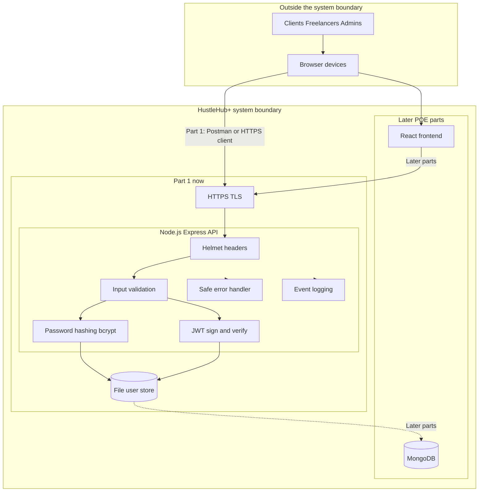

# Architecture diagram — Blessing

Part 1 requires a MERN architecture diagram with security features and system boundaries.

Save your exported PNG as `docs/images/architecture-diagram.png`, then add this line to the README:

```markdown

```

You can screenshot the Mermaid diagram below (GitHub also renders it) and tidy it in draw.io if you prefer.



## Must show

- React (later), Express + Node, MongoDB (later)
- HTTPS boundary
- Validation, hashing, JWT, controlled errors
- Part 1 file storage vs later MongoDB
