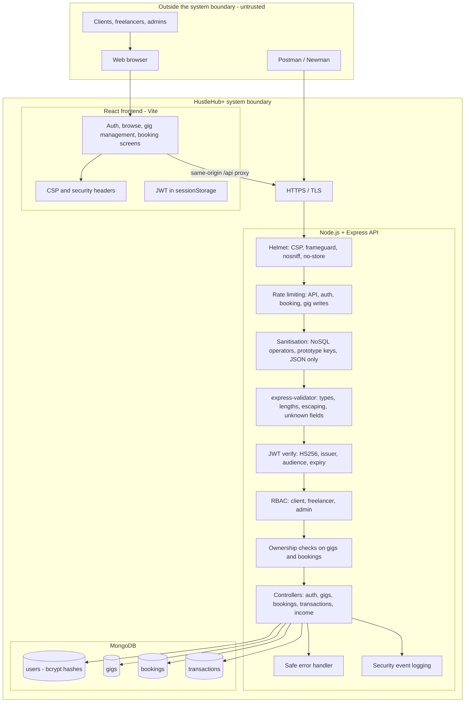
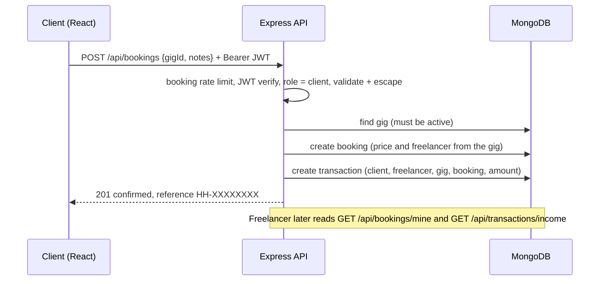

# HustleHub+ architecture (Part 2)

The MERN system with its security controls and system boundaries. GitHub renders this diagram directly; export it to `docs/images/architecture-diagram.png` if the README image needs refreshing.

```mermaid
flowchart TB
  subgraph outside [Outside the system boundary - untrusted]
    Users[Clients, freelancers, admins]
    Browser[Web browser]
    Tools[Postman / Newman]
  end

  subgraph hustlehub [HustleHub+ system boundary]
    subgraph frontend [React frontend - Vite]
      UI[Auth, browse, gig management, booking screens]
      CSP[CSP and security headers]
      Session[JWT in sessionStorage]
    end

    TLS[HTTPS / TLS]

    subgraph api [Node.js + Express API]
      Helmet[Helmet: CSP, frameguard, nosniff, no-store]
      Limits[Rate limiting: API, auth, booking, gig writes]
      Sanitise[Sanitisation: NoSQL operators, prototype keys, JSON only]
      Validate[express-validator: types, lengths, escaping, unknown fields]
      Authn[JWT verify: HS256, issuer, audience, expiry]
      Rbac[RBAC: client, freelancer, admin]
      Owner[Ownership checks on gigs and bookings]
      Ctrl[Controllers: auth, gigs, bookings, transactions, income]
      Errors[Safe error handler]
      Logs[Security event logging]
    end

    subgraph db [MongoDB]
      UsersCol[(users - bcrypt hashes)]
      Gigs[(gigs)]
      Bookings[(bookings)]
      Txns[(transactions)]
    end
  end

  Users --> Browser --> UI
  UI --> CSP
  UI -->|"same-origin /api proxy"| TLS
  Tools --> TLS
  TLS --> Helmet --> Limits --> Sanitise --> Validate --> Authn --> Rbac --> Owner --> Ctrl
  Ctrl --> UsersCol
  Ctrl --> Gigs
  Ctrl --> Bookings
  Ctrl --> Txns
  Ctrl --> Errors
  Ctrl --> Logs
```

## Booking flow

```mermaid
sequenceDiagram
  participant C as Client (React)
  participant A as Express API
  participant M as MongoDB
  C->>A: POST /api/bookings {gigId, notes} + Bearer JWT
  A->>A: booking rate limit, JWT verify, role = client, validate + escape
  A->>M: find gig (must be active)
  A->>M: create booking (price and freelancer from the gig)
  A->>M: create transaction (client, freelancer, gig, booking, amount)
  A-->>C: 201 confirmed, reference HH-XXXXXXXX
  Note over A,M: Freelancer later reads GET /api/bookings/mine and GET /api/transactions/income
```
